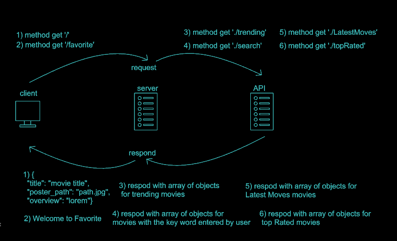

# Movies-Library - 1.2

**Author Name**: ibraheem areeda

## WRRC
**version 1.0**

**version 1.1**

**version 1.2**

## Getting Started
Assuming you’ve already installed Node.js, create a directory to hold your application, and make that your working directory.

1- $ mkdir myapp
   $ cd myapp

2- $ npm init

3- $ npm install express

4- $ npm install cors

5- $ npm install axios

6- $ npm install -g nodemon

7- $ npm install body-parser

8-$ npm install pg

9-$npm install dotenv

10- $ nodemon server.js

11- create a API key from https://developers.themoviedb.org/3/getting-started/introduction
to use it in the requests

## Project Features

NOTE : ALL THE METHODS ARE (GET) METHODS

http://localhost:3006/favorite => Welcome to Favorite Page

http://localhost:3006/ => 

{
  "title": "Spider-Man: No Way Home",
  "poster_path": "/1g0dhYtq4irTY1GPXvft6k4YLjm.jpg",
  "overview": "Peter Parker is unmasked and no longer able to separate his normal life from the high-stakes of being a super-hero. When he asks for help from Doctor Strange the stakes become even more dangerous, forcing him to discover what it truly means to be Spider-Man."
}

./trending => respond with array of objects for trending movies

./search => respond with array of objects for movies with the key word entered by user

./LatestMoves => respond with array of objects for Latest Moves movies

./topRated => respond with array of objects for top Rated movies

./addmovie => post method that allow the use to add a new record of movie in databace 

/allMovies =>get method that allow the see all added records in databace 

insted of ./ it will be like this
("http://localhost:3006/THE RAOUT YOU WANT TO REQUEST")

